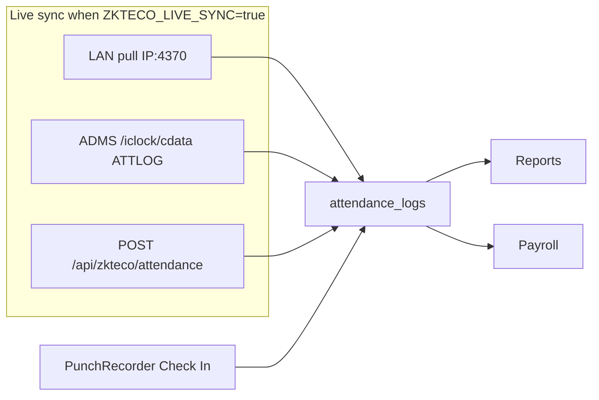
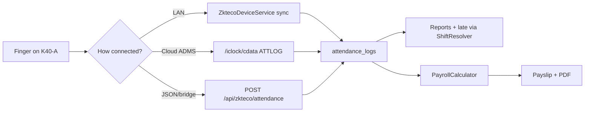
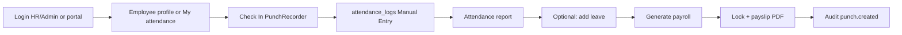
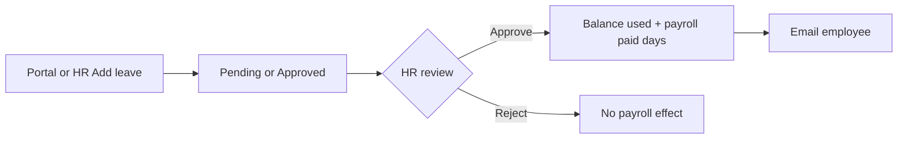

# Payroll EmsoftBD — Internship / Practicum Defense Guide

Use this file during viva. If a board member asks **“ei jinish tar logic koi?”**, jump to [Section 5](#5-feature-map--logic-koi). If they ask **“same feature implement korte hole ki ki file?”**, use [Section 6](#6-how-to-implement-a-similar-new-feature).

---

## 1. One-minute project pitch

**Payroll EmsoftBD** is a role-based **HRMS**: biometric attendance (ZKTeco), leave, roster, and monthly payroll.

| Actor | What they do |
|---|---|
| **Employee (portal User)** | Check In/Out (demo), view own punches, request leave, download payslip PDF |
| **Manager** | Own **department** only: reports, punch edits, leave |
| **HR Manager** | Employees, leave, payroll, reports (no Users, no Devices, no Settings) |
| **Admin** | Operations + devices + settings + audit (not Users) |
| **Super Admin** | Everything, including Users & Roles |

**Highlight feature (likely the main viva topic):** ZKTeco attendance pipeline — device pull (LAN UDP/TCP), ADMS cloud push (`/iclock/*`), JSON push API, **and** a demo Check In/Out that writes the **same** `attendance_logs` table. Payroll is generated from those punches + leave + salary components.

**Stack:** Laravel 10, PHP 8.1+, Blade + Bootstrap 5, MySQL/MariaDB (phpMyAdmin dump) / SQLite (tests), `0mithun/php-zkteco`, DomPDF, Laravel Sanctum.

**Honest demo line:** Live device sync is off (`ZKTECO_LIVE_SYNC=false`) so the board demo does not depend on a physical K40-A. Punch → report → payroll still uses production logic.

---

## 2. How a request travels (say this in viva)

```
Browser
  → public/index.php
  → bootstrap/app.php + app/Http/Kernel.php
  → routes/web.php  (or routes/api.php)
  → middleware: auth + can:{permission}
  → Controller (HTTP only)
  → Service (business logic) + Model (database)
  → Notification / redirect
  → resources/views/*.blade.php
```

**Important sentence for the board:**

> Controllers handle HTTP. Business logic lives in `app/Services`. Data lives in `app/Models`. Permissions are Laravel Gates from `User::rolePermissionMap()`. Views live in `resources/views`.

Unlike a modular monolith, this app is a **single Laravel app**. Feature groups are route middleware (`can:manage-payroll`), not `Modules/` folders.

Device punches are special: `/iclock/*` is **public**, **no CSRF** (`VerifyCsrfToken::$except`), because a fingerprint terminal cannot log in.

---

## 3. Project file structure (what lives where)

```
Production Payroll Emsoft/
├── app/
│   ├── Console/Commands/         # zkteco:sync-all, zkteco:push-cloud
│   ├── Http/
│   │   ├── Controllers/Web/      # Browser UI
│   │   ├── Controllers/Api/      # Sanctum + ZKTeco ADMS/JSON
│   │   ├── Middleware/           # CSRF except iclock/*
│   │   └── Requests/Api/         # JSON validation
│   ├── Jobs/                     # SyncZktecoDeviceAttendanceJob
│   ├── Models/                   # Eloquent tables
│   ├── Notifications/            # Leave + payslip email
│   ├── Providers/AppServiceProvider.php   # Gate::define for every permission
│   └── Services/                 # ★ CORE LOGIC
│       ├── Attendance/PunchRecorder.php
│       ├── Zkteco/               # Device pull, ADMS, JSON parse
│       ├── Payroll/PayrollCalculator.php
│       ├── Leave/LeaveBalanceService.php
│       ├── Roster/ShiftResolver.php
│       ├── Reports/PeriodSummaryService.php
│       ├── Audit/AuditLogger.php
│       └── Notify/HrNotifier.php
├── config/zkteco.php             # ZKTECO_LIVE_SYNC flag
├── database/migrations/          # Schema
├── database/seeders/             # AdminUserSeeder (DatabaseSeeder is empty)
├── payroll.sql                   # phpMyAdmin dump used for local demo
├── public/                       # Web root
├── resources/views/              # Blade UI
├── routes/web.php, api.php
├── tests/Feature/                # PHPUnit
└── DEFENSE.md                    # This file
```

### Controller vs Service — viva answer

| Question | Answer |
|---|---|
| Where is payroll math? | `app/Services/Payroll/PayrollCalculator.php` — **not** the Blade payslip. |
| Where is Check In/Out logic? | `app/Services/Attendance/PunchRecorder.php` |
| Where is ZKTeco LAN pull? | `app/Services/Zkteco/ZktecoDeviceService.php` (`getAttendances()`) |
| Where is ADMS ATTLOG ingest? | `app/Services/Zkteco/ZktecoAdmsService.php` |
| Who only redirects / validates? | Web controllers under `app/Http/Controllers/Web/` |

---

## 4. Roles, middleware, permissions

### 4.1 Five roles

Defined as constants on `app/Models/User.php`:

| Role constant | DB value | After login |
|---|---|---|
| `ROLE_SUPER_ADMIN` | `super_admin` | Dashboard `/` |
| `ROLE_ADMIN` | `admin` | Dashboard `/` |
| `ROLE_HR` | `hr_manager` | Dashboard `/` |
| `ROLE_MANAGER` | `manager` | Dashboard `/` (dept-scoped data) |
| `ROLE_USER` | `user` | `/me/attendance` if `employee_id` is set |

`User::homeRouteName()` + `DashboardController::index()` send portal users away from the admin dashboard.

### 4.2 Gates (not Spatie)

Registered in `app/Providers/AppServiceProvider.php`:

```php
foreach (array_keys(User::permissions()) as $ability) {
    Gate::define($ability, fn (User $user) => $user->hasPermission($ability));
}
```

Routes use `middleware('can:manage-payroll')` etc.

| Permission | Who has it |
|---|---|
| `view-reports` | Super Admin, Admin, HR, Manager |
| `manage-attendance` | Super Admin, Admin, HR, Manager |
| `manage-employees` | Super Admin, Admin, HR |
| `manage-devices` | Super Admin, Admin |
| `manage-leave` | Super Admin, Admin, HR, Manager |
| `manage-payroll` | Super Admin, Admin, HR |
| `manage-settings` | Super Admin, Admin |
| `manage-users` | Super Admin only |
| `view-audit` | Super Admin, Admin |

**Portal User** has **zero** Gate permissions. They only use `/me/*` because they are `auth` and linked via `users.employee_id`.

**Viva line:** “A portal employee cannot open `/payroll` because that route uses `can:manage-payroll`. Even if they guess the URL, Laravel returns 403.”

### 4.3 Manager team scope

`User::isTeamScoped()` is true only for `manager`. Lists filter by the manager’s linked employee `department_id` (`canAccessEmployee()`, `scopeManagedEmployees()`). If the manager is not linked to an employee with a department, team lists stay empty.

---

## 5. Feature map — “logic koi?”

For each feature: **entry (route/UI) → controller → logic → data → view**.

### 5.1 Authentication (login / password reset)

| Layer | File |
|---|---|
| UI | `resources/views/auth/login.blade.php`, `forgot-password.blade.php`, `reset-password.blade.php` |
| Routes | `routes/web.php` (guest group) |
| Controller | `app/Http/Controllers/Web/AuthController.php`, `PasswordResetController.php` |
| User | `app/Models/User.php` (`homeRouteName()`) |

**Flow:** Login → `Auth::attempt` → session regenerate → `intended(homeRouteName())`. Forgot password uses Laravel’s broker; locally `MAIL_MAILER=log` puts the link in `storage/logs`.

---

### 5.2 Dashboard

| Layer | File |
|---|---|
| UI | `resources/views/welcome.blade.php` (named `home`) |
| Controller | `app/Http/Controllers/Web/DashboardController.php` |
| Summaries | `app/Services/Reports/PeriodSummaryService.php` |

Shows today’s present/late/leave counts, device last-seen, payroll snapshot. Portal users never stay here.

---

### 5.3 Employees & organization

| Layer | File |
|---|---|
| List / CRUD / profile | `EmployeeManagementController` + `resources/views/employees/` |
| Form | `resources/views/employees/_form.blade.php` |
| Dept / designation | `DepartmentController`, `DesignationController`, `organization.index` |
| Model | `app/Models/Employee.php` — `employee_code` = device PIN |

**Employee code** must match the ZKTeco user ID / PIN. Reports join punches on `attendance_logs.employee_code`.

**Import missing codes:** punches exist for a PIN with no employee row → banner + `importMissing()`.

Profile (`employees/show`) is the HR dashboard: Check In/Out, salary package, overtime rate, shifts, leave balances, absences, recent punches (date → day editor, source column), leave history + reason, payslip view/PDF.

---

### 5.4 Check In / Check Out (MAIN DEMO FEATURE)

**This is the feature to defend if there is no physical device.**

| Layer | File | What it does |
|---|---|---|
| Admin UI | `resources/views/employees/show.blade.php` | Green Check In / red Check Out |
| Portal UI | `resources/views/me/attendance.blade.php` | Same toggle for the logged-in employee |
| Routes | `POST /employees/{employee}/punch` (`can:manage-attendance`) | Admin punches anyone in scope |
| | `POST /me/attendance/punch` (`auth`) | Employee punches **self** only |
| Controllers | `EmployeeManagementController::punchNow`, `SelfServiceController::punchNow` | Auth + redirect |
| **Engine** | **`app/Services/Attendance/PunchRecorder.php`** | ★ Toggle in/out, insert, audit |
| Table | `attendance_logs` | Same table as ZKTeco |
| Device row | Manual Entry (`0.0.0.0:0`, `is_active=false`) | Satisfies `device_id` FK; excluded from live sync |

#### Toggle rule (memorize this)

```
last punch today is missing or "out"  →  next status = in
last punch today is "in"              →  next status = out
punched_at = now()
```

Unique index: `(device_id, employee_code, punched_at, status)` — double-click same second + same status is rejected.

**Critical viva sentence:**

> Manual Check In is not a fake table. It is a device punch with source “Manual Entry”. Reports and payroll do not care whether the row came from UDP port 4370 or a button.

---

### 5.5 ZKTeco live attendance (production path)

Three ingest paths, all gated by `config('zkteco.live_sync')` (`ZKTECO_LIVE_SYNC` in `.env`).



| Path | Entry | Service | Insert |
|---|---|---|---|
| **A — LAN pull** | Devices → Sync now, or `php artisan zkteco:sync-all` every 5 minutes | `ZktecoDeviceService::syncAttendance` | `insertOrIgnore` |
| **B — ADMS push** | Device Cloud Server → `GET/POST /iclock/cdata` | `ZktecoAdmsService::ingestAttLog` | `insertOrIgnore` |
| **C — JSON push** | `POST /api/zkteco/attendance` | `ZktecoAttendanceController` + `ZktecoPushParser` | `firstOrCreate` |
| **Office PC bridge** | `php artisan zkteco:push-cloud --url=…` | Pull locally, POST ATTLOG to cloud | Cloud ADMS path |

Library: `0mithun/php-zkteco` (`ZKTeco::connect()`, `getAttendances()`). Needs PHP **`sockets`** extension.

Device status mapping (`ZktecoDeviceService::normalizeStatus`): numeric `0,2` → `in`; `1,3` → `out`.

ADMS handshake returns options (`Stamp`, `Realtime=1`, …). CSRF is off for `iclock/*` so the terminal can POST.

**When live sync is false (current demo `.env`):** scheduler skipped, Sync now warns, ADMS ATTLOG returns `OK` but does not insert, JSON push returns **503**. Banner on Devices page.

**Office-to-cloud:** if the app is on the internet but the K40-A is on LAN, run `zkteco:push-cloud` on an office PC (`ZktecoPushCloudCommand`).

---

### 5.6 Attendance reports & day editor

| Layer | File |
|---|---|
| Daily report + CSV | `AttendanceReportController` + `resources/views/reports/attendance.blade.php` |
| Day editor | `AttendanceRecordController` + `reports/day.blade.php` |
| Summary (late / absence / leave / OT) | `SummaryReportController` + `PeriodSummaryService` |

Daily check-in/out is **computed**, not stored:

```sql
GROUP BY DATE(punched_at)
MIN(punched_at) AS check_in
MAX(punched_at) AS check_out   -- only if max > min
```

**`attendance_days` table exists in migrations but is unused.** If asked: “We roll up from `attendance_logs` at query time so punches stay the source of truth.”

Late / half-day: `ShiftResolver::lateInfo()` — shift start + grace, else global `AttendancePolicy` (`work_start_time`, `grace_minutes`, `half_day_after_minutes`).

---

### 5.7 Leave, holidays, balances

| Layer | File |
|---|---|
| HR list / approve / reject | `LeaveRequestController` + `resources/views/leave/` |
| Types / holidays | `LeaveTypeController`, `HolidayController` |
| Balances | `LeaveBalanceService` + `leave/balances.blade.php` |
| Portal request | `SelfServiceController::leaveStore` |
| Email | `HrNotifier` + `LeaveSubmittedNotification` / `LeaveReviewedNotification` |

Statuses: `pending` / `approved` / `rejected`. **Only approved paid leave** (`leave_types.is_paid`) affects payroll.

Days counted exclude the employee’s weekend (`weekend_days`, default **Friday + Saturday**) and holidays.

Quota: `annual_quota - SUM(approved days this year)`. Approving past quota is blocked.

Profile **Add leave** opens `leave.create?employee_id=` so the employee is pre-selected.

---

### 5.8 Roster / shifts

| Layer | File |
|---|---|
| UI | `RosterController` + `resources/views/roster/` |
| Logic | `app/Services/Roster/ShiftResolver.php` |
| Tables | `shifts`, `employee_shift_assignments` |

Assignment window: `effective_from` … `effective_to` (nullable = open-ended). Used by reports and payroll for expected work minutes and late cutoff. No calendar grid — list/form UI.

---

### 5.9 Payroll (MAIN MATH FEATURE)

| Layer | File |
|---|---|
| Generate / lock / CSV / HTML payslip | `PayrollController` |
| PDF | `PayrollController::payslipPdf` + DomPDF |
| Salaries | `SalaryController` |
| Allowances / deductions | `SalaryComponentController` + `SalaryComponent::resolve()` |
| **Engine** | **`app/Services/Payroll/PayrollCalculator.php`** |
| Email on lock | `PayslipReadyNotification` |

#### Formula (memorize this)

```
per_day            = monthly_salary / working_days
absent_days        = max(0, working_days − present_days − paid_leave_days)
absent_deduction   = absent_days × per_day
late_deduction     = half_days × 0.5 × per_day
overtime_hours     = extra minutes beyond shift (or std daily hours) / 60
overtime_amount    = overtime_hours × overtime_rate
allowances         = sum of earning components (fixed or % of basic)
component_deduct   = sum of deduction components (PF, tax, …)
gross              = monthly + overtime_amount + allowances
total_deductions   = absent_deduction + late_deduction + component_deduct
net                = gross − total_deductions
```

`present_days` = distinct dates with at least one punch.  
`working_days` is entered (or suggested) **per run**. Suggestion uses **Fri–Sat weekend** (`Employee::DEFAULT_WEEKEND_DAYS`) minus holidays — Bangladesh-style, not Carbon’s Sat–Sun `isWeekend()`.

Lock: `locked_at` set → cannot regenerate or delete. Unlock is Super Admin/Admin/HR with `manage-payroll`.

---

### 5.10 Company settings & late policy

| Layer | File |
|---|---|
| Company name / logo | `CompanySettingController` + `CompanySetting::current()` |
| Late policy | `LatePolicyController` + `AttendancePolicy` |
| Shell branding | `AppServiceProvider` View composer → `layouts.app` |

---

### 5.11 Audit log

| Layer | File |
|---|---|
| UI | `AuditLogController` + `resources/views/audit/index.blade.php` |
| Writer | `app/Services/Audit/AuditLogger.php` |

Logged today: punches (create/update/delete), HR leave, salary updates, users. **Not** every payroll generate or device sync. If asked: “Sensitive HR mutations are audited; device ingest is high-volume so we log to `storage/logs` instead.”

---

### 5.12 Self-service portal (`/me/*`)

| Route | View | Notes |
|---|---|---|
| `me.attendance` | `me/attendance.blade.php` | Check In/Out + date filter |
| `me.leave` / create | `me/leave*.blade.php` | Own requests + balances |
| `me.payslips` | `me/payslips.blade.php` | Generated/locked runs + PDF |

Requires `users.employee_id`. Enable on employee form (**Portal login**) or Users & Roles.

---

### 5.13 REST API (Sanctum)

| Method | Path | Auth |
|---|---|---|
| POST | `/api/login` | Public → token |
| POST | `/api/zkteco/attendance` | **Public** (devices) |
| GET/POST/PUT/DELETE | `/api/employees`, `/api/devices` | Bearer token |
| GET | `/api/attendance-logs` | Bearer token |
| POST | `/api/logout` | Bearer token |

**Viva honesty:** API currently checks `auth:sanctum` only, not the same Gates as the web UI. Web RBAC is the product surface; API is for device/integration. If asked “what would you add?”: reuse `can:` / policies on API routes.

---

## 6. How to implement a similar new feature

Board: *“If you add overtime request approval, which files?”*

Use this **same 8-step pattern** as Check In or payroll:

| Step | What | Example files |
|---|---|---|
| 1 | Migration | `database/migrations/xxxx_create_….php` |
| 2 | Model + relations | `app/Models/….php` — `hasMany` on `Employee` |
| 3 | **Service (logic)** | `app/Services/….php` |
| 4 | Permission | Add key to `User::permissions()` + `rolePermissionMap()` |
| 5 | Controller | `app/Http/Controllers/Web/….php` |
| 6 | Routes + `can:` | `routes/web.php` |
| 7 | Blade + nav | `resources/views/` + `layouts/app.blade.php` |
| 8 | Audit + test | `AuditLogger`, `tests/Feature/….php` |

**Do not** put payroll formulas or punch toggle rules in Blade. Put them in a Service so reports and portal can reuse them (as `PunchRecorder` is reused by admin profile and `/me/attendance`).

---

## 7. Workflows (draw these on the board if asked)

### 7.1 Device (production) → payroll



### 7.2 Defense demo (no device)



### 7.3 Leave



### 7.4 Login landing

```mermaid
flowchart LR
  A[POST /login] --> B{role = user AND employee_id?}
  B -->|Yes| C[/me/attendance]
  B -->|No| D[Dashboard /]
```

---

## 8. Database (tables you should name in viva)

| Table | Purpose |
|---|---|
| `users` | Login + `role` + optional `employee_id` |
| `employees` | Name, `employee_code` (device PIN), dept, designation, weekend_days |
| `departments` / `designations` | Org chart |
| `devices` | IP, port, SN, `is_active`, `last_seen_at` |
| `attendance_logs` | **Source of truth** for punches |
| `attendance_policies` | Global start / grace / half-day |
| `shifts` / `employee_shift_assignments` | Roster |
| `leave_types` / `leave_requests` / `holidays` | Leave |
| `salary_structures` | Monthly + overtime rate |
| `salary_components` | Recurring earning/deduction |
| `payroll_runs` | Month, working_days, `locked_at` |
| `payslips` / `payslip_items` | Snapshot of one employee-month |
| `company_settings` | Name, logo |
| `audit_logs` | Who changed what |
| `password_reset_tokens` / `personal_access_tokens` | Reset + Sanctum |

**Unused:** `attendance_days` (migration exists, no model writes). Daily totals are queried from logs.

Relations (short):

- User N—1 Employee (portal link)
- Employee 1—N AttendanceLog (via `employee_code`)
- Device 1—N AttendanceLog
- Employee 1—1 SalaryStructure, 1—N SalaryComponents, LeaveRequests, ShiftAssignments
- PayrollRun 1—N Payslips 1—N PayslipItems

Unique punch: `(device_id, employee_code, punched_at, status)`.

---

## 9. Controllers (quick index)

| Area | Controller | Responsibility |
|---|---|---|
| Auth | `AuthController`, `PasswordResetController` | Login, reset |
| Home | `DashboardController` | KPIs |
| People | `EmployeeManagementController` | CRUD, profile, admin punch |
| Org | `DepartmentController`, `DesignationController` | Dept / title |
| Devices | `DeviceManagementController` | CRUD, Sync now, push-setup page |
| ADMS | `ZktecoAdmsController` | `/iclock/*` |
| JSON push | `ZktecoAttendanceController` | `POST /api/zkteco/attendance` |
| Reports | `AttendanceReportController`, `SummaryReportController` | Tables + CSV + charts data |
| Punches | `AttendanceRecordController` | Day editor |
| Leave | `LeaveRequestController`, `LeaveTypeController`, `HolidayController`, `LeaveBalanceController` | Full leave module |
| Roster | `RosterController` | Shifts + assignments |
| Payroll | `PayrollController`, `SalaryController`, `SalaryComponentController` | Runs, salaries, PDF |
| Settings | `CompanySettingController`, `LatePolicyController` | Branding + late rules |
| Users | `UserManagementController` | Roles + employee link |
| Audit | `AuditLogController` | History |
| Portal | `SelfServiceController` | `/me/*` |
| API | `AuthTokenController`, `EmployeeController`, `DeviceController`, `AttendanceLogController` | Sanctum |

---

## 10. Views / UI map

| Path | Screens |
|---|---|
| `layouts/app.blade.php` | Shell, role-gated nav, flash messages |
| `auth/` | Login, forgot, reset |
| `employees/` | List, form, **profile dashboard** |
| `devices/` | List, form, push-setup, live-sync-off banner |
| `reports/` | Daily attendance, day editor, summary |
| `leave/` | Requests, types, holidays, balances |
| `roster/` | Shifts |
| `payroll/` | Generate, run, salaries, components, payslip |
| `me/` | Portal attendance / leave / payslips |
| `audit/` | Audit table |
| `settings/` | Company + late policy |
| `users/` | Users & roles |

Nav is permission-gated in `layouts/app.blade.php`. Portal-only users see **My attendance / My leave / My payslips** only.

---

## 11. Likely board questions & short answers

**Q: Why Laravel?**  
MVC, auth, migrations, Eloquent, mail, Gates, scheduler. Fast to build a multi-role HR app with device HTTP endpoints.

**Q: Where is the biometric SDK?**  
LAN: `0mithun/php-zkteco` over UDP/TCP 4370. Cloud: native ZKTeco ADMS protocol on `/iclock/cdata`. We did not reverse-engineer a private API; we implemented the documented push/pull paths.

**Q: Is Check In cheating?**  
No. Same `attendance_logs` + unique key + reports + payroll. Source column shows Manual Entry vs Main-Gate. Live sync is a config flag for defense vs production.

**Q: How do you stop an employee from generating payroll?**  
Route `can:manage-payroll`. Portal role has no Gates.

**Q: How do you stop a manager seeing another department?**  
`User::isTeamScoped()` + `canAccessEmployee()`.

**Q: How is net salary calculated?**  
Section 5.9. Absent and half-day deductions from daily rate; overtime from extra minutes × hourly rate; components as fixed or % of basic.

**Q: Why Friday–Saturday weekend?**  
Bangladesh office default (`Employee::DEFAULT_WEEKEND_DAYS = [5, 6]`). Carbon `isWeekend()` is Sat–Sun and would suggest the wrong working_days.

**Q: Duplicate punches?**  
Unique `(device_id, employee_code, punched_at, status)` + `insertOrIgnore` / `firstOrCreate`.

**Q: What if the device and the server are on different networks?**  
ADMS if the device has Cloud Server and a public `APP_URL`, or `zkteco:push-cloud` on a LAN PC.

**Q: Why is `/iclock` public?**  
Terminals cannot hold a Laravel session or CSRF token. We identify the device by serial number (`SN`) and optionally auto-register it.

**Q: How do you test?**  
`php artisan test` — Feature tests: API auth, portal login, manager scope + leave notify, punch toggle + live-sync-off, payroll lock, Fri–Sat working days, leave form preselect, audit.

**Q: Empty `db:seed`?**  
`DatabaseSeeder` is empty. Local demo used `payroll.sql`. Fresh admin: `php artisan db:seed --class=AdminUserSeeder` → `admin@example.com` / `password` **only if that user does not already exist** (seeder `firstOrCreate` does not reset an existing hash).

**Q: What would you add next?**  
API Gates; opening leave balances; calendar roster; wire or drop unused `attendance_days`; optional LLM-free shift auto-assign.

---

## 12. Demo & run (for live demo)

```bash
composer install
# .env already has DB + APP_KEY for this machine
php artisan serve --host=127.0.0.1 --port=8000
```

Open `http://127.0.0.1:8000`

**Database:** MySQL `emsoftbd_payroll` imported from `payroll.sql` (phpMyAdmin / mysql CLI). User `root`, empty password (XAMPP).

| Role | Email | Notes |
|---|---|---|
| Super Admin (dump) | `admin@example.com` | Password is the **production dump hash** — not necessarily `password` |
| Portal example | employee with portal enabled (e.g. Sarder / code 1696) | Lands on My attendance |
| Fresh seeder | `admin@example.com` / `password` | Only on empty users table |

**Demo script (5 minutes):**

1. Login as **HR/Admin** → Employees → open a profile → **Check In** → show Recent punches (In, source Manual Entry).  
2. Click punch **date** → day editor (same log). Open **Attendance report**.  
3. **Add leave** (employee pre-selected) → approve if pending → balances.  
4. **Payroll → Generate** (working days already Fri–Sat) → open payslip → **PDF**.  
5. **Audit** → `punch.created`.  
6. **Devices** → banner “Live device sync is off” → explain production ADMS/LAN.  
7. Optional: logout, login as **portal employee** → My attendance **Check Out**.

Keep `ZKTECO_LIVE_SYNC=false` unless a real device is on `192.168.68.201:4370`.

---

## 13. Bangla viva cheat-sheet

- **Project ta ki?** Role-based HRMS — ZKTeco attendance, leave, roster, payroll, employee portal.  
- **Main contribution?** Device punch pipeline + payroll from those punches. Demo te Check In same `attendance_logs` e likhe.  
- **Logic koi?** `app/Services/` — `PunchRecorder`, `ZktecoDeviceService`, `ZktecoAdmsService`, `PayrollCalculator`, `ShiftResolver`, `LeaveBalanceService`. Controller shudhu HTTP.  
- **Notun similar feature?** Migration → Model → Service → Gate permission → Controller → Route `can:` → Blade → Test.  
- **Security?** `auth` + `can:` Gates; CSRF except `iclock/*`; manager department scope; portal user er kono payroll permission nai.  
- **Device chara demo?** `ZKTECO_LIVE_SYNC=false`; profile/My attendance Check In/Out. Production e flag `true`.  
- **Salary kivabe?** Basic − absent − half-day late + OT + components = net. Formula section 5.9.  
- **Weekend?** Default Friday–Saturday, per employee override.

---

## 14. File touch-map (print / keep open)

| If they ask about… | Open these files first |
|---|---|
| Login / portal landing | `AuthController.php`, `User::homeRouteName()` |
| RBAC | `User.php` `permissions()` / `rolePermissionMap()`, `AppServiceProvider.php` |
| **Check In/Out** | **`PunchRecorder.php`**, `employees/show.blade.php`, `me/attendance.blade.php` |
| **ZKTeco LAN** | **`ZktecoDeviceService.php`**, `DeviceManagementController::syncNow` |
| **ADMS / iclock** | **`ZktecoAdmsController.php`**, `ZktecoAdmsService.php`, `routes/web.php` |
| JSON push | `ZktecoAttendanceController.php` |
| Live sync off | `config/zkteco.php`, `.env` `ZKTECO_LIVE_SYNC` |
| Late / shift | `ShiftResolver.php`, `AttendancePolicy.php` |
| **Payroll formula** | **`PayrollCalculator.php`** |
| Payslip PDF | `PayrollController::payslipPdf` |
| Leave quota | `LeaveBalanceService.php` |
| Audit | `AuditLogger.php` |
| Nav / roles | `resources/views/layouts/app.blade.php` |
| Tables | `database/migrations/` |
| Tests | `tests/Feature/ManualPunchAndLiveSyncTest.php`, `PayrollLockTest.php` |

---

*Payroll EmsoftBD — ZKTeco HRMS / Attendance · Laravel 10 · Defense reference. Keep this file open during viva (`DEFENSE.md`).*
